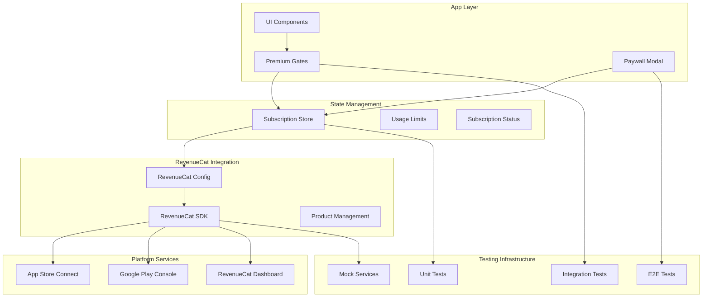

# Design Document

## Overview

This design document outlines the technical architecture for implementing and testing a comprehensive RevenueCat subscription system for the Oxalate Diet Tracker app. The system provides a robust, scalable solution for managing premium subscriptions with proper usage limits, error handling, and comprehensive testing coverage.

The design builds upon the existing implementation while addressing gaps in testing, error handling, and production readiness. It ensures compliance with app store guidelines and provides a seamless user experience across all subscription-related features.

## Architecture

### High-Level Architecture



### Component Architecture

The system follows a layered architecture with clear separation of concerns:

1. **Presentation Layer**: UI components, premium gates, paywall modal
2. **State Management Layer**: Zustand store with usage tracking and subscription status
3. **Integration Layer**: RevenueCat configuration and SDK integration
4. **Platform Layer**: App Store Connect, Google Play Console, RevenueCat Dashboard
5. **Testing Layer**: Comprehensive test suite with mocks and utilities

## Components and Interfaces

### Core Components

#### 1. Subscription Store (`useSubscriptionStore`)

**Purpose**: Central state management for subscription status, usage limits, and purchase operations.

**Key Responsibilities**:
- Manage subscription status (free/premium/loading)
- Track usage limits for Oracle, recipes, and tracking
- Handle purchase and restore operations
- Provide usage validation methods
- Manage daily/monthly limit resets

**Interface**:
```typescript
interface SubscriptionStore {
  // State
  status: SubscriptionStatus;
  customerInfo: CustomerInfo | null;
  offerings: PurchasesOffering[] | null;
  usageLimits: UsageLimits;
  
  // Actions
  initializePurchases: () => Promise<void>;
  purchaseProduct: (productId: string) => Promise<boolean>;
  restorePurchases: () => Promise<boolean>;
  
  // Usage Management
  incrementOracleQuestions: () => boolean;
  incrementRecipeCount: () => boolean;
  startTracking: () => boolean;
  
  // Usage Validation
  canAskOracleQuestion: () => boolean;
  canCreateRecipe: () => boolean;
  canTrack: () => boolean;
  
  // Usage Information
  getRemainingOracleQuestions: () => number;
  getRemainingRecipes: () => number;
  getRemainingTrackingDays: () => number;
}
```

#### 2. Premium Gate Component (`PremiumGate`)

**Purpose**: Conditional rendering component that shows premium upgrade prompts or blocks access based on subscription status and usage limits.

**Key Features**:
- Feature-specific gating (oracle/recipes/tracking)
- Customizable messaging and upgrade prompts
- Seamless integration with paywall modal
- Support for both blocking and promotional modes

**Props Interface**:
```typescript
interface PremiumGateProps {
  children: React.ReactNode;
  feature: 'oracle' | 'recipes' | 'tracking';
  action?: 'view' | 'create' | 'use';
  showUpgradePrompt?: boolean;
  customMessage?: string;
}
```

#### 3. Paywall Modal Component (`PaywallModal`)

**Purpose**: Full-screen modal for subscription purchase flow with feature-specific messaging and pricing options.

**Key Features**:
- Feature-specific content and messaging
- Monthly and yearly subscription options
- Purchase and restore functionality
- Loading states and error handling
- Compliance with app store guidelines

**Props Interface**:
```typescript
interface PaywallModalProps {
  visible: boolean;
  onClose: () => void;
  feature?: 'oracle' | 'recipes' | 'tracking';
}
```

#### 4. RevenueCat Configuration (`configureRevenueCat`)

**Purpose**: Centralized configuration and initialization of RevenueCat SDK with proper error handling and testing support.

**Key Features**:
- Platform-specific API key management
- Debug logging in development
- Graceful fallback for missing configuration
- Testing mode support for bypassing premium checks

### Data Models

#### Usage Limits Model

```typescript
interface UsageLimits {
  oracleQuestions: {
    // Free tier: 10 questions per month
    monthlyLimit: number;
    monthlyCount: number;
    lastMonthlyResetDate: string;
    // Premium tier: 40 questions per day (abuse prevention)
    dailyLimit: number;
    todayCount: number;
    lastResetDate: string;
  };
  recipes: {
    // Free tier: 1 recipe total
    freeLimit: number;
    currentCount: number;
    // Premium tier: 10 recipes per day (abuse prevention)
    dailyLimit: number;
    todayCount: number;
    lastResetDate: string;
  };
  tracking: {
    // Free tier: 3 consecutive days
    freeDays: number;
    startDate: string | null;
    daysUsed: number;
  };
}
```

#### Subscription Status Model

```typescript
type SubscriptionStatus = 'free' | 'premium' | 'loading';

interface SubscriptionInfo {
  status: SubscriptionStatus;
  isPremium: boolean;
  isActive: boolean;
  willRenew: boolean;
  productIdentifier: string | null;
  expirationDate: Date | null;
  nextBillingDate: Date | null;
}
```

## Error Handling

### Error Categories and Strategies

#### 1. Network and Connectivity Errors

**Strategy**: Graceful degradation with cached status
- Cache last known subscription status locally
- Continue with cached status during network issues
- Retry operations with exponential backoff
- Provide offline mode indicators

#### 2. Purchase Flow Errors

**Strategy**: User-friendly error messages with recovery options
- Map RevenueCat error codes to user-friendly messages
- Provide specific guidance for common issues
- Offer alternative actions (restore purchases, contact support)
- Log detailed error information for debugging

**Error Mapping**:
```typescript
const ERROR_MESSAGES = {
  PURCHASES_ERROR_USER_CANCELLED: 'Purchase was cancelled.',
  PURCHASES_ERROR_PAYMENT_PENDING: 'Payment is pending. Please check back later.',
  PURCHASES_ERROR_STORE_PROBLEM: 'There was a problem with the app store. Please try again.',
  PURCHASES_ERROR_PURCHASE_NOT_ALLOWED: 'Purchases are not allowed on this device.',
  PURCHASES_ERROR_INVALID_SUBSCRIBER_STATE: 'Invalid subscriber state. Please contact support.',
};
```

#### 3. Configuration Errors

**Strategy**: Fallback to demo mode with clear developer guidance
- Detect missing or invalid API keys
- Provide clear setup instructions in development
- Enable demo mode for development and testing
- Log configuration issues with actionable guidance

#### 4. State Synchronization Errors

**Strategy**: Eventual consistency with conflict resolution
- Handle race conditions in usage limit updates
- Implement optimistic updates with rollback capability
- Synchronize state across app restarts
- Resolve conflicts by favoring user-beneficial outcomes

## Testing Strategy

### Testing Pyramid

#### 1. Unit Tests (Foundation)

**Scope**: Individual functions and components in isolation
**Coverage**: 90%+ for core subscription logic

**Key Test Areas**:
- Subscription store state management
- Usage limit calculations and resets
- Purchase flow logic
- Error handling functions
- Configuration utilities

**Example Test Structure**:
```typescript
describe('Subscription Store', () => {
  describe('Usage Limits', () => {
    it('should enforce monthly Oracle question limits for free users');
    it('should allow unlimited Oracle questions for premium users');
    it('should reset daily limits at midnight');
    it('should reset monthly limits on month boundary');
  });
  
  describe('Purchase Flow', () => {
    it('should handle successful purchase and update status');
    it('should handle purchase cancellation gracefully');
    it('should restore purchases when valid subscription exists');
  });
});
```

#### 2. Integration Tests (Middle Layer)

**Scope**: Component interactions and data flow
**Coverage**: Critical user journeys and feature interactions

**Key Test Areas**:
- Premium gate behavior with different subscription states
- Paywall modal purchase flow integration
- Cross-feature usage limit interactions
- State persistence and restoration

**Example Test Structure**:
```typescript
describe('Premium Feature Integration', () => {
  it('should show premium gate when free user reaches Oracle limit');
  it('should unlock all features when upgrading to premium');
  it('should maintain independent limits across features');
  it('should persist usage limits across app restarts');
});
```

#### 3. End-to-End Tests (Top Layer)

**Scope**: Complete user workflows from UI to backend
**Coverage**: Critical subscription journeys

**Key Test Areas**:
- Complete purchase flow from premium gate to feature unlock
- Subscription restoration on new device
- Feature access validation across app sections
- Error recovery scenarios

#### 4. Mock and Testing Infrastructure

**RevenueCat SDK Mocking**:
```typescript
// Mock RevenueCat for testing
jest.mock('react-native-purchases', () => ({
  default: {
    configure: jest.fn(),
    getCustomerInfo: jest.fn(),
    getOfferings: jest.fn(),
    purchaseProduct: jest.fn(),
    restorePurchases: jest.fn(),
  },
  LOG_LEVEL: { DEBUG: 'DEBUG' },
}));
```

**Test Utilities**:
- Mock customer info factory
- Usage limit test helpers
- Subscription state builders
- Error scenario generators

### Testing Environments

#### 1. Development Testing

**Setup**:
- Use RevenueCat sandbox environment
- Enable debug logging
- Mock network conditions
- Test with various device states

#### 2. Staging Testing

**Setup**:
- Use RevenueCat production environment with test products
- Test with real App Store Connect sandbox accounts
- Validate complete purchase flows
- Test subscription management features

#### 3. Production Testing

**Setup**:
- Monitor real subscription metrics
- A/B test paywall variations
- Track conversion rates and user behavior
- Validate subscription renewal flows

## Implementation Phases

### Phase 1: Core Infrastructure Enhancement

**Objectives**:
- Enhance existing subscription store with robust error handling
- Implement comprehensive testing infrastructure
- Add proper configuration management
- Create mock services for testing

**Deliverables**:
- Enhanced subscription store with error handling
- Complete unit test suite
- Mock RevenueCat service for testing
- Configuration validation utilities

### Phase 2: UI Component Refinement

**Objectives**:
- Enhance premium gate component with better UX
- Improve paywall modal with feature-specific content
- Add loading states and error handling to UI
- Implement accessibility features

**Deliverables**:
- Enhanced PremiumGate component
- Improved PaywallModal with better UX
- Integration tests for UI components
- Accessibility compliance

### Phase 3: Production Readiness

**Objectives**:
- Set up RevenueCat dashboard configuration
- Configure App Store Connect and Google Play Console
- Implement analytics and monitoring
- Create deployment and testing procedures

**Deliverables**:
- Production RevenueCat configuration
- Store product configuration
- Analytics implementation
- Deployment documentation

### Phase 4: Advanced Features and Optimization

**Objectives**:
- Implement advanced subscription features
- Add A/B testing capabilities
- Optimize conversion rates
- Add advanced analytics

**Deliverables**:
- Promo code support
- Family sharing implementation
- A/B testing framework
- Advanced analytics dashboard

## Security Considerations

### API Key Management

- Use public API keys only (never secret keys in mobile apps)
- Store API keys in environment variables
- Validate API key format and source
- Implement key rotation procedures

### Purchase Validation

- Rely on RevenueCat for server-side validation
- Never trust client-side purchase status alone
- Implement receipt validation through RevenueCat
- Handle edge cases in validation failures

### Data Privacy

- Minimize collection of personal data
- Comply with GDPR and CCPA requirements
- Implement data export capabilities
- Provide clear privacy policy

## Performance Considerations

### State Management

- Use efficient state updates with Zustand
- Implement proper memoization for expensive calculations
- Cache subscription status locally
- Minimize unnecessary re-renders

### Network Optimization

- Implement request caching for subscription status
- Use exponential backoff for failed requests
- Batch multiple operations when possible
- Implement offline-first approach

### Memory Management

- Properly dispose of RevenueCat listeners
- Clean up timers and intervals
- Implement proper component unmounting
- Monitor memory usage in subscription flows

## Monitoring and Analytics

### Key Metrics

- Subscription conversion rates by feature
- Monthly recurring revenue (MRR)
- Customer lifetime value (LTV)
- Churn rate and retention metrics
- Feature usage patterns

### Error Monitoring

- Track subscription-related errors
- Monitor purchase flow completion rates
- Alert on critical error thresholds
- Implement crash reporting for subscription flows

### A/B Testing Framework

- Test different paywall designs
- Experiment with pricing strategies
- Optimize feature gate messaging
- Measure impact of UX changes

This design provides a comprehensive foundation for implementing and testing a robust RevenueCat subscription system that meets all the specified requirements while ensuring scalability, reliability, and maintainability.